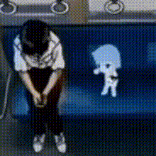
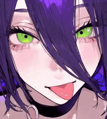
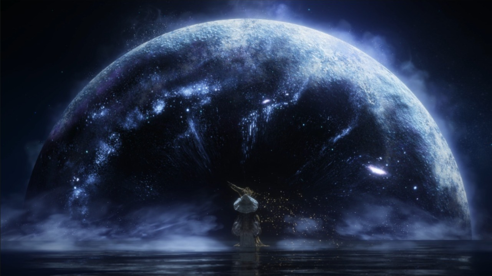
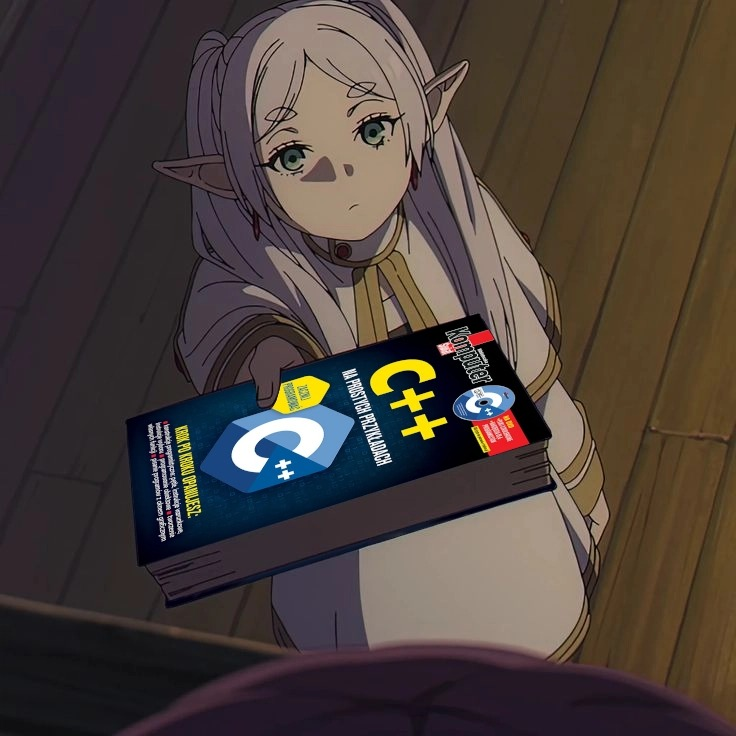

# Presentacion del Proyecto

**Autor** [Dylan Ortiz]

## Descripcion

Este es el repositorio para la tarea 1 del curso. El objetivo es demostrar el flujo de trabajo basico con git y github

## Pasos Realizados 🏃‍♂️🚶‍♂️

1. Creacion del repositorio Local.

2. Creacion de este archivo `presentacion.md`

3. conexion con GitHub


## Nota adicional 🐱‍👤

Este archivo fue editado desde el repositorio local como parte del flujo de trabajo con Git y errores mios por hacer todo alrevez




---

## Code 💻

```javascript
# Comandos usados en Git bash para relaizar esta tarea 📑

git mkdir
git cd
git init
git status
git add
git commit -m
git log
git remote
git push
```


## Canciones escuchadas durante el proceso de esta tarea 🔊🎧🎶

Cancion | Autor | Enlaces
------- | ------ | -------
In the pool | Kensuke Ushio | [YouTube](https://www.youtube.com/results?search_query=Kensuke+Ushio+In+the+Pool)
Dardos | Romeo santos, Principe Royce | [YouTube](https://www.youtube.com/results?search_query=Romeo+Santos+Prince+Royce+Dardos)
Sienna | The Marias | [YouTube](https://www.youtube.com/results?search_query=The+Marias+Sienna)
Restless Dreams | dxnrm | [YouTube](https://www.youtube.com/results?search_query=dxnrm+Restless+Dreams)
DIABLA | Los Diozes | [YouTube](https://www.youtube.com/results?search_query=Los+Diozes+Diabla)





---


## ¿Quien soy? 👾🎮🎧
Mi Nombre es Dylan Alejandro Ortiz Usma , tengo 17 años , soy estudiante de 2 semestre de la (**Pontificia Universidad Javeriana Cali**). Soy una persona que le gustan mucho los videojuegos y escuchar musica de todo tipo, soy una persona muy introvertida pero me gusta pasar el rato con mis amigos y uno de mis sueños es ser ingeniero en sistemas para crear un videojuego y asi representar mi pais a mi modo. Me gusta ver peliculas , anime , series y leer uno que otro libro.




## Conclusión 😼

Durante el desarrollo de esta actividad se aplicaron los conceptos fundamentales del uso de **Git** y **GitHub**, permitiendo comprender el flujo básico de trabajo para el control de versiones. Se aprendió a clonar un repositorio desde **GitHub Classroom**, realizar modificaciones en un entorno local y gestionar correctamente los cambios mediante los comandos `git add`, `git commit` y `git push`.

Además, se reforzó el uso del lenguaje **Markdown** para documentar el proyecto, empleando títulos, listas, tablas y enlaces, lo cual facilita la presentación clara y ordenada de la información. En conjunto, esta práctica permitió afianzar habilidades esenciales para el trabajo colaborativo y el manejo de proyectos de software, sentando bases sólidas para futuros desarrollos académicos y profesionales.



